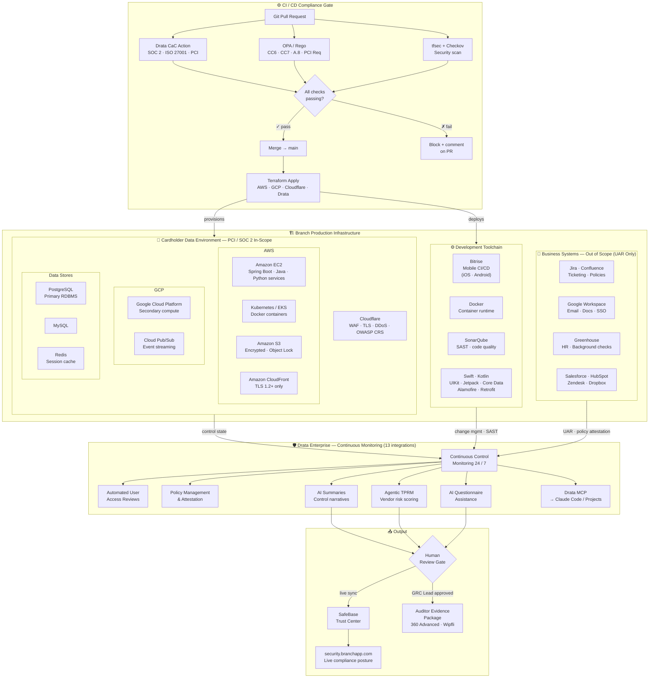

# BranchApp-GRC-Engineering-Program
# Plan of action to implment GRC Engineering at BranchApp
# Branch — Compliance as Code

> Automated GRC programme for SOC 2 Type 2 · ISO 27001:2022 · PCI DSS v4.0

**Current sprint:** SOC 2 Type 2 evidence automation — June 2026  
**Auditors:** 360 Advanced · Wipfli  
**Platform:** Drata Enterprise + SafeBase  
**Trust Center:** [security.branchapp.com](https://security.branchapp.com)

---

## Repo Map

```
branch-compliance-as-code/
│
├── terraform/          Infrastructure controls as code (AWS, GCP, Cloudflare, Drata)
├── rego/               OPA policy engine rules — SOC 2, ISO 27001, PCI DSS
├── agents/             AI agent configs, prompts, and workflows (Drata MCP, evidence, TPRM)
├── drata/              Control-to-Terraform mappings and HITL gate definitions
├── .github/workflows/  CI/CD pipelines (Drata CaC, tfsec, Checkov, compliance monitor)
├── docs/               GitHub Pages site — compliance dashboard
└── scripts/            Utility scripts (Rego test runner, coverage checker)
```

## Architecture

Branch's compliance-as-code system maps directly onto the existing tech stack.
The diagram below shows how the three layers — **CI/CD gate**, **production infrastructure**, and **Drata monitoring** — connect across all 65 tools.



### Layer Summary

| Layer | Tools from Branch Stack | Compliance Role |
|-------|------------------------|----------------|
| **CI Gate** | Terraform, GitHub Actions, Bitrise | Blocks non-compliant IaC before it ships |
| **CDE — AWS** | EC2, S3, CloudFront, Kubernetes, Docker | Primary payment processing; PCI + SOC 2 in-scope |
| **CDE — GCP** | Cloud Platform, Cloud Pub/Sub | Event streaming; PCI + SOC 2 in-scope |
| **CDE — Data** | PostgreSQL, MySQL, Redis | Encrypted at rest; PCI + SOC 2 in-scope |
| **Network** | Cloudflare | WAF, TLS enforcement, DDoS — PCI Req 1 + 4 |
| **Dev Toolchain** | Bitrise, Docker, SonarQube, Swift, Kotlin | SAST, container scanning, change management |
| **Business Systems** | Jira, Confluence, Google Workspace, Greenhouse, Salesforce, HubSpot, Zendesk, Dropbox | Out of PCI scope — UAR and policy attestation only |
| **Drata** | Drata Enterprise + SafeBase | Continuous monitoring across all 13 integrations |
| **AI Agents** | Drata MCP, Claude Code | Evidence drafting, vendor risk, questionnaire pre-fill |

### Scope Boundary

```
┌─────────────────────────── PCI CDE Boundary ────────────────────────────┐
│  AWS EC2 · EKS/Kubernetes · S3 · CloudFront                             │
│  GCP Cloud Platform · Cloud Pub/Sub                                     │
│  PostgreSQL · MySQL · Redis                                             │
│  Cloudflare (connected-to CDE — no CHD storage)                        │
└─────────────────────────────────────────────────────────────────────────┘

Outside CDE (UAR + policy evidence only):
  Jira · Confluence · Google Workspace · Greenhouse
  Salesforce · HubSpot · Zendesk · Dropbox
```

## Quick Start

```bash
# 1. Clone
git clone https://github.com/branch-app/compliance-as-code
cd branch-compliance-as-code

# 2. Infrastructure — see terraform/README.md
cd terraform/environments/production
terraform init && terraform plan -var-file=terraform.tfvars

# 3. Rego policies — test all policies
./scripts/test-rego.sh

# 4. Agents — see agents/README.md
# Configure Drata MCP in Claude Code or Claude Projects
```

## Framework Status

| Framework | Audit Window | Method | Automation |
|-----------|-------------|--------|-----------|
| SOC 2 Type 2 | June 2026 | Drata CCM + manual | ~35% → target 85% |
| ISO 27001:2022 | Q3–Q4 2026 | Drata + Rego | ~20% → target 80% |
| PCI DSS v4.0 | Q1–Q2 2027 | Terraform + Drata CaC | ~55% → target 90% |

## GRC Engineering Principles

This programme follows the [GRC Engineering Manifesto](https://grc.engineering) —  
authored by Ayoub Fandi, Justin Pagano, Charles Nwatu, and Terra Cooke.

- **Shift Left** — Drata CaC Action + Rego gate every PR before merge
- **Continuous Assurance** — Drata CCM runs 24/7 across all integrations
- **GRC as a Product** — SafeBase Trust Center serves customers; runbooks serve engineers
- **Human in the Loop** — AI drafts, humans approve before any evidence leaves Branch

## Contributing

See [CONTRIBUTING.md](CONTRIBUTING.md). All Terraform and Rego changes require:
1. PR with description of control impact
2. Drata CaC Action passing
3. Rego test suite passing (`./scripts/test-rego.sh`)
4. GRC Lead review for control additions/removals
